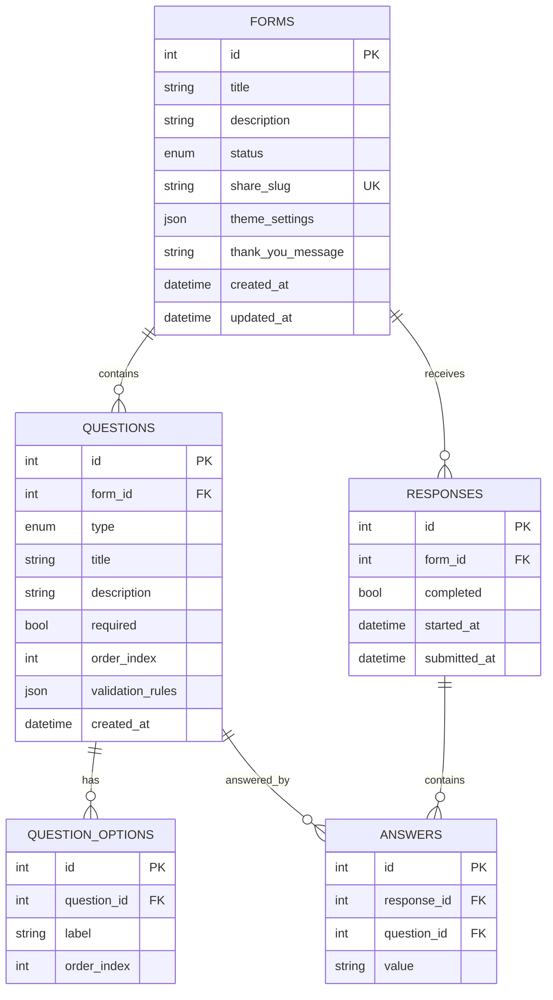

# Learning Notes

## backend/app/models.py (SQLAlchemy Schema)
- **What problem this solves**: Defines the database schema and relational mapping for the core entities of the application (Forms, Questions, Question Options, Responses, Answers).
- **Why this approach over the obvious alternative**: We chose to normalize `QuestionOption` into a separate table instead of storing options as JSON within the `Question` model. While storing options as JSON is faster to query (one less JOIN), a separate table gives us referential integrity—if a user submits an answer, they point to a specific option ID, meaning if the option text changes later, the answer remains semantically linked to the correct choice. Conversely, `validation_rules` is stored as JSON because validation requirements are highly heterogeneous per question type (e.g. `min_length` for text, `min_selections` for checkboxes), which is an anti-pattern to model relationally.
- **Concepts to understand**:
  - **Declarative Base**: In SQLAlchemy, models inherit from a `Base` class, which acts as a registry. When we define models, SQLAlchemy automatically tracks them so it can create the corresponding tables in the database.
  - **relationship() vs ForeignKey()**: `ForeignKey` tells the database exactly which column in another table this row points to (the "physical" link). `relationship` is an ORM (Object Relational Mapping) concept that allows you to easily access related objects in Python. For instance, `form.questions` will fetch all related questions without you having to manually write a SQL `JOIN` query. 
  - **cascade="all, delete-orphan"**: This tells SQLAlchemy that if a `Form` is deleted, all associated `Question` objects should be automatically deleted too. The "orphan" part ensures that if you remove a `Question` from the `form.questions` list in Python, it gets deleted from the database instead of being left unattached (orphaned).

### Database Architecture

## backend/app/crud.py (Bulk Question Reordering)
- **What problem this solves**: When a user drags and drops questions in the builder, they change the order of multiple questions at once. Sending `N` sequential `PUT` requests to update each question individually is inefficient and violates the API conventions.
- **Why this approach over the obvious alternative**: We expose a single `PUT /reorder` endpoint that accepts an array of question IDs in their new order. In `crud.py`, we fetch all questions for the form, map them by ID, and update their `order_index` in a loop before issuing a single `db.commit()`. This groups all updates into a single database transaction, ensuring atomicity and reducing DB round-trips.
- **Concepts to understand**:
  - **Transaction Atomicity**: `db.commit()` ensures that either all the `order_index` updates succeed, or none of them do. If an error occurs halfway through, the database rolls back, preventing corrupted state (like two questions having the same index).
  - **In-memory Mapping**: By querying all questions at once and creating a dictionary (`q_map = {q.id: q for q in questions}`), we avoid executing a separate `SELECT` query inside the loop for every single ID, significantly improving backend performance.

## frontend DragDropList and Framer Motion logic
- **What problem this solves**: Gives users immediate, fluid visual feedback when building and reordering questions, while persisting the new order to the backend efficiently.
- **Why this approach over the obvious alternative**: We use `@dnd-kit/core` rather than raw HTML5 drag-and-drop because it provides smoother animations and robust accessibility out of the box. For saving state, we perform an optimistic UI update by immediately mutating the local `questions` array via `arrayMove`, then sending the bulk reorder array to the backend, rather than waiting for the backend to confirm before updating the UI. For transitions in `LivePreviewPane`, we use `framer-motion`'s `AnimatePresence` combined with `key={question.id}`. By setting a unique key based on the active question's ID, Framer Motion automatically triggers the `exit` animation of the previous question and the `initial`/`animate` state of the new question without any complex tracking logic.
- **Concepts to understand**:
  - **Optimistic UI**: Updating the local state first makes the UI feel instantaneous. If the API request fails, we'd typically revert the local state back to the original order (though not fully handled here to keep it simple).
  - **AnimatePresence with Keys**: React destroys and recreates components when their `key` changes. `AnimatePresence` intercepts the unmounting phase, allowing the old component to run its `exit` animation before being removed from the DOM.
